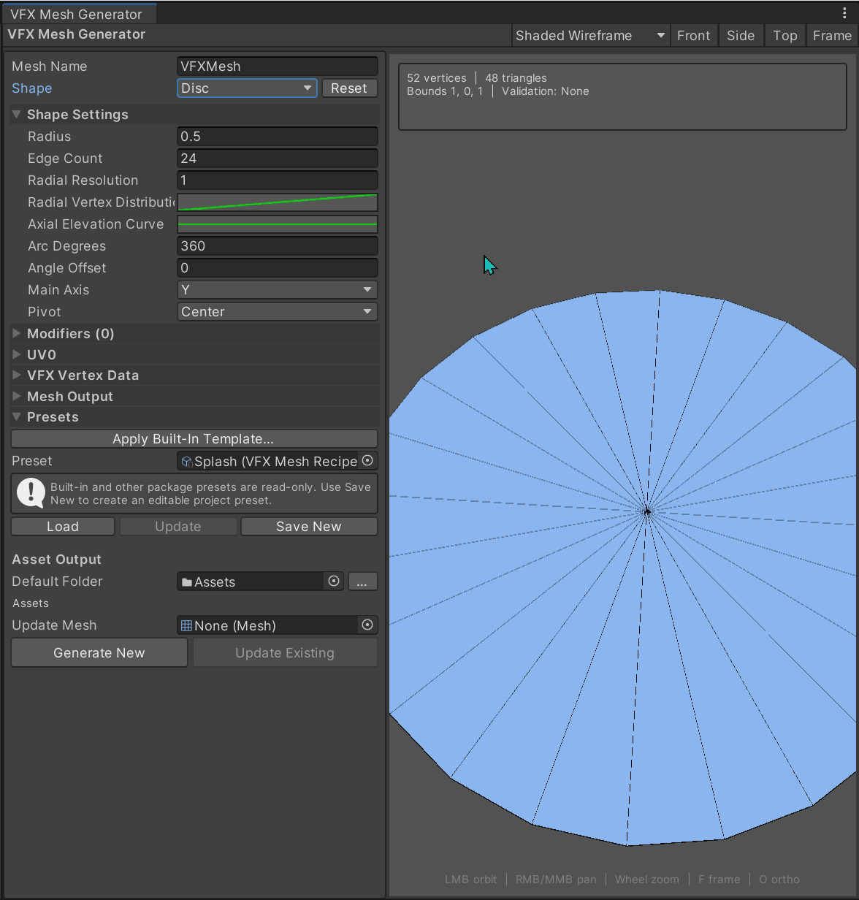

# VFX Mesh Lab


A Unity 6+ URP editor tool for building VFX-ready meshes without leaving Unity.

Start from 14 procedural shapes or seven included templates, art-direct the result with curves and ordered modifiers, inspect UVs and vertex data live, then generate or update a standard Unity `Mesh` asset. Generated meshes have no runtime package dependency.

Made by [Ken Deng / PudinKiller](https://github.com/PudinKiller).

[Installation](#installation) | [Quick Start](#quick-start) | [Common Workflows](#common-workflows) | [Shape Reference](#shape-reference) | [Troubleshooting](#troubleshooting)

---

## Feature Demos

### Built-In Templates

<p align="center">
  
  <br>
  <sub>Apply an included starting recipe, customize it, then save an editable project preset.</sub>
</p>

<table>
  <tr>
    <td width="50%" align="center">
      <b>Shape and Modifier Workflow</b>
      <br><br>
      
      <br>
      <sub>Build suitable topology, add an ordered modifier, and tune it with immediate preview feedback.</sub>
    </td>
    <td width="50%" align="center">
      <b>Mirrored Arc Workflow</b>
      <br><br>
      
      <br>
      <sub>Shape and mirror a volumetric slash shell while keeping its outer rims joined.</sub>
    </td>
  </tr>
</table>

---

## Why This Exists

Real-time VFX often depends on small, specialized meshes: a slash, impact ring, tapered ribbon, hollow beam, crossed cards, or geometry carrying shader data. Moving to a DCC for every adjustment can interrupt iteration and still leave UV direction, pivots, vertex data, winding, or output settings to fix afterward.

VFX Mesh Lab is deliberately focused rather than a replacement for a full modeling package: it keeps common procedural VFX mesh creation, inspection, and regeneration inside the Unity editor.

---

## Core Features

| Feature | What it is useful for |
|---|---|
| 14 procedural shapes | Start from common VFX geometry instead of an empty modeling scene |
| Curves and ordered modifiers | Shape profiles, distribute vertices, and layer transform, taper, twist, bend, wave, ripple, noise, and other deformations |
| VFX-focused Arc tools | Taper, elevate, redistribute, and mirror slash or crescent shells while keeping their outer rims joined |
| UV and shader-data authoring | Generate UV0 projections, vertex colors, and packed `Vector4` data in UV1, UV2, and UV3 |
| Live diagnostic preview | Inspect shading, UVs, normals, vertex colors, wireframe, topology, and red backfaces |
| Templates and reusable presets | Start from seven included recipes or save complete custom generator setups |
| Native Mesh output | Create standalone `.asset` meshes with no runtime package dependency |
| Reference-preserving updates | Regenerate an existing Mesh asset while preserving its GUID and project references |
| Persistent workspace | Restore independent settings per shape, output folder, preview preferences, foldouts, and presets |
| Guarded editor workflow | Reset only the active shape and reject excessive topology before synchronous generation begins |

---

## Requirements

- Unity `6000.0` or newer
- A compatible Universal Render Pipeline package installed in the project
- Git, only when installing directly from a Git URL

> [!IMPORTANT]
> Install URP before VFX Mesh Lab. The preview shader uses URP shader libraries, but the package intentionally does not pin a specific URP package version.

The tool is editor-only. Generated Mesh assets are normal Unity assets and do not require VFX Mesh Lab at runtime.

---

## Installation

### Option 1: Install a Tagged Release from Git

This method requires Git to be installed on your computer.

In Unity:

1. Open `Window > Package Manager`.
2. Click the `+` button.
3. Choose `Add package from git URL`.
4. Paste:

```text
https://github.com/PudinKiller/VFXMeshLab.git#v1.0.0
```

Using a version tag keeps the installed package stable. To follow the latest code on `main`, omit `#v1.0.0`.

<details>
<summary><b>Install without Git</b></summary>

### Option 2: Install Using ZIP

Use this method if Unity says Git is not installed.

1. Open the [GitHub Releases page](https://github.com/PudinKiller/VFXMeshLab/releases).
2. Download `Source code (zip)` for the version you want.
3. Unzip it somewhere on your computer.
4. In Unity, open `Window > Package Manager`.
5. Click the `+` button.
6. Choose `Add package from disk`.
7. Select the unzipped package's `package.json`.

### Option 3: Install Using `.tgz`

If a `.tgz` package is attached to a GitHub Release:

1. Download the `.tgz` file.
2. In Unity, open `Window > Package Manager`.
3. Click the `+` button.
4. Choose `Install package from tarball`.
5. Select the downloaded `.tgz` file.

</details>

---

## Quick Start

Open the tool from:

```text
Tools > VFX Mesh Lab
```

1. Apply a built-in template or choose a procedural Shape.
2. Adjust the shape profile and add any ordered modifiers.
3. Configure UV0 and the vertex-data channels required by the shader.
4. Inspect the result in `Shaded Wireframe` or `UV Checker` view.
5. Set the Mesh Name, output folder, and Mesh Output options.
6. Click `Generate New`, then save the setup as a recipe preset if you want to reuse it.
7. Later, assign the asset to `Update Mesh` and use `Update Existing` to regenerate it without breaking references.

---

## Preview Controls

| Input | Action |
|---|---|
| Left mouse drag | Orbit |
| Right or middle mouse drag | Pan |
| Mouse wheel | Zoom |
| Double-click | Frame the generated mesh |
| `F` | Frame the generated mesh |
| `O` | Toggle orthographic preview |
| Front / Side / Top | Snap to an axis-aligned view |

Preview modes:

- `Shaded`
- `Unlit`
- `Wireframe`
- `UV Checker`
- `Normals`
- `Vertex Colors`
- `Shaded Wireframe`

Backfaces are drawn in red to make winding and open geometry problems easier to identify. Preview visualization does not change the saved mesh.

When `UV Checker` is selected, the toolbar exposes an optional custom Texture2D. Leave it empty for the built-in procedural checker; assigned textures use their import filtering and wrap settings.

The overlay displays vertex count, triangle count, bounds, validation flags, and generation warnings.

The `Reset` button beside the Shape selector restores only the selected shape profile. It does not clear other remembered shapes, modifiers, UV settings, vertex data, output settings, or the mesh name.

---

## Common Workflows

<details>
<summary><b>Create a tapered mirrored slash</b></summary>

Start with:

```text
Shape: Arc
Inner Radius: Set the inside edge
Outer Radius: Set the outside edge
Arc Degrees: Set the slash sweep
Angular Width Curve: Taper one or both ends
Radial Width Origin: Anchor the taper at the outer rim, middle, or inner rim
Mirror Across Shape Plane: On
```

Useful follow-up settings:

```text
Axial Elevation Curve: Shape the shell profile
UV Projection: Along Length or Shape Default
Double Sided: Enable only when independently lit backfaces are required
```

The Angular Width Curve scales radial thickness around the selected origin. `Outer Rim` moves only the inner radius, `Middle` moves both radii evenly, and `Inner Rim` moves only the outer radius. A zero curve value collapses the strip to the selected radial origin. Axial elevation remains referenced to the outer rim so mirrored shells stay joined.

Use `Radial Vertex Distribution` to move intermediate radial rows without changing either rim. A curve above the diagonal concentrates rows near the outer rim. Shape Default and Radial UVs retain their original row coordinates, so the moved geometry stretches or compresses the texture mapping.

`Mirror Across Shape Plane` creates a disconnected reflected shell with matching UVs and aligns both shells at the outer rim. It is different from `Double Sided`, which duplicates reversed faces at the same positions.

</details>

<details>
<summary><b>Create a fan, sector, or curved impact disc</b></summary>

Start with:

```text
Shape: Disc
Arc Degrees: Reduce below 360 for an open fan
Angle Offset: Rotate the fan
Radial Resolution: Add center-to-rim rows
Radial Vertex Distribution: Bias rows toward the inner or outer rim
Axial Elevation Curve: Push the surface along Main Axis
```

The distribution curve remaps vertex positions while the original Shape Default and Radial UV row coordinates remain fixed. This stretches the texture between moved rows and can make an outward texture scroll start fast and slow near the rim. Keep the curve rising from 0 to 1; place it above the diagonal to pack more rows near the outer rim. Increase Radial Resolution for a smoother speed transition.

</details>

<details>
<summary><b>Create an impact or shockwave ring</b></summary>

Start with:

```text
Shape: Ring
Inner Radius: Set the hole size
Outer Radius: Set the effect radius
Axial Elevation Curve: Shape a flat, raised, or curved profile
Radial Vertex Distribution: Control inner-to-outer row density
```

Try a radial or shape-default UV layout depending on how the shader samples its texture.

Both layouts preserve the undistributed inner-to-outer row coordinate when Radial Vertex Distribution moves geometry, allowing non-uniform texture scrolling without editing UVs separately.

Use vertex colors or a packed UV channel to store normalized radial distance for masks, erosion, displacement, or timing offsets.

</details>

<details>
<summary><b>Create a tapered ribbon or trail mesh</b></summary>

Start with:

```text
Shape: Ribbon
Width Scale Curve: Taper the start and end
Length Segments: Increase before adding deformation
UV Projection: Shape Default
Shape Default Width UV: Preserve Texel Density
```

Useful modifiers:

```text
Bend -> Wave -> Noise
```

Modifier order matters. A wave added after a bend produces a different result from bending an already-wavy ribbon.

`Preserve Texel Density` narrows the UV footprint with the ribbon and removes diagonal interpolation kinks. Use `Stretch To Width` when every row must fill U 0-1; ordinary triangle interpolation can show chevrons on low-resolution tapers in that mode.

</details>

<details>
<summary><b>Create a beam, tunnel, or hollow volume</b></summary>

Use:

```text
Cylinder: Filled cylindrical body
Tube: Hollow cylindrical body
Cone: Tapered or pointed volume
```

Set `Arc Degrees` below 360 for an open radial section. Use `Cap Start` and `Cap End` to close the minimum and maximum ends along the Main Axis.

Use `Radius Scale Curve` to shape the volume from Main Axis start to end without adding a modifier.

Useful modifiers include Taper, Twist, Wave, Noise, and Inflate.

</details>

<details>
<summary><b>Create crossed smoke, flame, or foliage cards</b></summary>

Start with:

```text
Shape: Cross Planes
Plane Count: 2 or more
Main Axis: Match the effect's vertical direction
Width Scale Curve: Shape card width from bottom to top
```

Use an Axis Gradient in Vertex Colors to store a bottom-to-top mask. Add extra intersecting planes when the effect needs more angular coverage.

</details>

<details>
<summary><b>Create an energy spiral</b></summary>

Start with:

```text
Shape: Helix
Turns: Number of revolutions
Pitch: Distance traveled per revolution
Strip Width: Base ribbon width
Width Scale Curve: Taper along the spiral
```

Add Twist, Wave, or Noise for secondary motion. Use `Along Length` UVs for scrolling textures.

</details>

---

## Shape Reference

| Shape | Main controls | Typical VFX uses |
|---|---|---|
| Quad | Width, length, width scale, subdivisions | Sprites, decals, flashes, simple cards |
| Disc | Radius, sweep, radial distribution/elevation, resolution | Fans, circular flashes, ground effects, radial masks |
| Ring | Inner/outer radius, radial distribution/elevation, resolution | Shockwaves, portals, ground rings |
| Arc | Ring controls, sweep, distribution, angular width origin, elevation, mirrored shell | Slashes, crescents, directional shockwaves |
| Cone | Height, bottom/top radius, radius scale, segments, caps | Spot volumes, directional bursts, funnels |
| Cylinder | Height, radius scale, radial and height segments, caps | Beams, columns, volumes |
| Tube | Height, inner/outer radius, radius scale, segments, caps | Hollow beams, tunnels, cylindrical shells |
| Sphere | Radius, radial profile scale, longitude, latitude | Energy fields, bursts, spherical masks |
| Hemisphere | Radius, radial profile scale, longitude, latitude, equator cap | Domes, ground shields, explosion shells |
| Torus | Major/minor radius, tube scale, ring/tube segments, sweep | Portals, energy loops, curved bands |
| Box | Size, cross-section scale, X/Y/Z subdivisions | Volumes, distortion regions, box masks |
| Ribbon | Width, length, width scale, Shape Default width UV mode, subdivisions | Trails, streaks, tapered strips |
| Cross Planes | Width, height, width scale, plane count, subdivisions | Smoke, flame, foliage, volumetric cards |
| Helix | Radius, strip width, turns, pitch, width scale | Spirals, coils, energy trails |

Every shape also supports:

- Main Axis: `X`, `Y`, or `Z`
- Pivot: `Center`, `Start`, `End`, or `Custom`
- Resolution controls appropriate to its topology

`Ring` is always a closed 360-degree loop. Use `Arc` when you need a partial annular sweep or an angular width profile. Disc supports its own partial sweep for filled fan geometry.

---

## Modifier Reference

Modifiers are evaluated from top to bottom and can be enabled, bypassed, reordered, or removed.

| Modifier | What it does |
|---|---|
| Transform | Offsets, scales, and rotates the complete mesh |
| Taper | Changes radial scale according to falloff |
| Twist | Rotates vertices progressively around an axis |
| Bend | Curves the mesh around the selected axis |
| Skew | Offsets the mesh progressively in axis or radial space |
| Wave | Adds repeating directional displacement |
| Radial Ripple | Adds wave displacement around the mesh center |
| Noise | Applies deterministic layered spatial displacement |
| Inflate | Pushes or pulls vertices using their normals |
| Spherize | Blends the mesh toward a spherical form |
| Flatten | Blends toward an axis plane or selected axis line |

Most deformation modifiers provide:

- An independent Axis
- Axis or Radial evaluation space
- An artist-authored falloff curve
- Strength, angle, phase, or frequency controls appropriate to the modifier

Noise also provides Seed, Octaves, Lacunarity, Persistence, sampling offset, and Axis or Radial displacement direction.

---

## UV0

UV0 is generated after deformation unless `Shape Default` is selected. Disc, Ring, and Arc use a deliberate mixed `Radial` mapping: angular U is projected from the final mesh, while radial V always uses the generator-authored inner-to-outer row coordinate. Radial Vertex Distribution and later vertex modifiers therefore stretch or compress V instead of reprojecting it.

Available projections:

| Projection | Typical use |
|---|---|
| Shape Default | Preserve UVs authored by the selected shape generator |
| Planar | Flat cards, decals, and axis-aligned meshes |
| Radial | Discs, rings, shockwaves, and radial masks |
| Cylindrical | Beams, tubes, cones, and cylindrical effects |
| Spherical | Spheres, domes, and radial volumes |
| Along Length | Ribbons, trails, arcs, and helices |
| Box | Boxes and meshes that need three-axis projection |

Final UV transforms include:

- Scale
- Offset
- Rotation around `(0.5, 0.5)`
- Flip U
- Flip V
- Swap U/V

Use `UV Checker` preview mode to inspect orientation, scale, distortion, and seams before saving.

For tapered Ribbons, `Preserve Texel Density` is the artifact-free Shape Default layout: U remains proportional to local mesh width, so both triangles share one affine mapping. `Stretch To Width` keeps U at 0-1 on every row, but a tapered trapezoid cannot express that projective mapping exactly with ordinary interpolated triangle UVs. Increase subdivisions if that legacy layout is required.

Sphere and Hemisphere Shape Default UVs split the shared pole per longitude sector, preventing unrelated sectors from interpolating toward one pole U coordinate. Latitude-longitude UVs still compress naturally at the pole; more subdivisions or another projection can trade that compression for different seams.

---

## VFX Vertex Data

### Vertex Colors

Write one `COLOR` value per vertex using:

- `Solid`
- `Axis Gradient`
- `Radial Gradient`

The gradient axis can be selected independently, making it useful for dissolve masks, bottom-to-top fades, radial timing, or shader-driven color variation.

### Packed UV Channels

UV1, UV2, and UV3 can each store a `Vector4` shader stream:

| Unity channel | Shader semantic |
|---|---|
| UV1 | `TEXCOORD1` |
| UV2 | `TEXCOORD2` |
| UV3 | `TEXCOORD3` |

Each X/Y/Z/W component can use one of these sources:

- Zero
- One
- Normalized X
- Normalized Y
- Normalized Z
- Along Axis
- Radial Distance
- Deterministic Random

Position and distance sources are normalized to `0-1` using the final mesh bounds. `Along Axis` follows the shape's Main Axis, while `Radial Distance` measures perpendicular distance from that axis.

These channels can carry masks, timing offsets, variation, normalized positions, custom coordinates, or other shader data without requiring a custom mesh post-process.

---

## Mesh Output

| Setting | Effect |
|---|---|
| Flip Winding | Reverses every triangle's front face |
| Double Sided | Duplicates vertices and reversed triangles for independently lit backfaces |
| Flat Shading | Splits vertices per triangle to create hard face normals |
| Generate Tangents | Calculates tangents from UV0 for tangent-space effects |
| Read/Write Enabled | Keeps or discards the CPU-readable copy after saving |
| Optimize Mesh | Reorders saved vertex and index buffers |
| Compression | Applies Unity mesh compression to the saved asset |
| Index Format | Selects Auto, UInt16, or UInt32 indices |
| Bounds Padding | Expands calculated local bounds on every side |

`Double Sided` approximately doubles mesh size. `Flat Shading` can increase vertex count substantially because vertices are split per triangle.

`Auto` index format uses 16-bit indices when possible and switches to 32-bit above 65,535 vertices.

---

## Generating and Updating Assets

### Generate New

`Generate New` creates a standalone native `.asset` Mesh inside the project's `Assets` folder. If the selected name already exists, Unity generates a unique path rather than replacing it.

### Update Existing

`Update Existing` replaces the selected standalone Mesh asset's data while preserving its GUID and project references.

The update is registered with Unity Undo, and the writer keeps a temporary in-memory backup for rollback if saving fails.

> [!WARNING]
> Updating still changes the selected asset on disk. Keep the project under version control and confirm the `Update Mesh` field before clicking `Update Existing`.

Imported model sub-assets are not supported as update targets.

---

## Presets and Persistent State

A `VFX Mesh Recipe Preset` stores the complete generator setup:

- Shape and shape settings
- Ordered modifier stack
- UV0 settings
- Vertex colors and packed UV channels
- Mesh output settings

Seven built-in starting points ship with the package:

- `Cross Plane`
- `Droplet`
- `Fan`
- `Shockwave`
- `Slash`
- `Spiral`
- `Splash`

Preset controls:

- `Apply Built-In Template...`: choose a packaged starting point and replace the current recipe
- `Load`: replace the current recipe with the selected preset
- `Update`: overwrite the selected editable project preset with the current recipe
- `Save New`: create an editable preset asset inside `Assets`

Built-in and other package presets are read-only. Apply one, adjust any settings you want, then use `Save New` to keep an editable project copy.

The editor also restores project-scoped working state, including independent parameters for each shape mode, the current recipe, output folder, preview mode, custom checker texture, preview background, modifier selection, foldouts, and selected preset.

---

## Safety Limits

Generation runs synchronously in the Unity editor, so the package validates topology before building.

Current limits include:

- 4,096 segments per axis
- 64 Cross Planes
- 12 Noise octaves
- 256 Helix turns
- Approximately 500,000 base vertices
- Approximately 1,000,000 final vertices after topology expansion

If a recipe exceeds a limit, the preview reports an error instead of attempting the build.

---

## Troubleshooting

<details>
<summary><b>The preview shader is missing or unsupported</b></summary>

Confirm that:

1. The project uses Unity 6 or newer.
2. A compatible Universal Render Pipeline package is installed.
3. The project has finished importing and compiling shaders.

The generator code is editor-only, but its preview shader includes URP shader libraries.

</details>

<details>
<summary><b>Unity says Git is not installed</b></summary>

The Git URL install method requires Git.

Use the ZIP or `.tgz` installation method instead.

</details>

<details>
<summary><b>The mesh appears invisible or inside out</b></summary>

Switch to a shaded preview and look for red backfaces.

Try:

```text
Flip Winding: On
```

or, when both sides must render as independent faces:

```text
Double Sided: On
```

</details>

<details>
<summary><b>The texture scrolls in the wrong direction</b></summary>

Try the UV transforms:

```text
Flip U
Flip V
Swap U/V
Rotation
```

For ribbons, arcs, and helices, compare `Shape Default` and `Along Length`.

</details>

<details>
<summary><b>My shader cannot read UV1, UV2, or UV3 data</b></summary>

Confirm that the channel is enabled in `VFX Vertex Data` and that the shader reads the matching semantic:

```text
UV1 -> TEXCOORD1
UV2 -> TEXCOORD2
UV3 -> TEXCOORD3
```

</details>

<details>
<summary><b>I cannot update a mesh from an FBX or another imported model</b></summary>

`Update Existing` supports standalone `.asset` Mesh objects only.

Generate a new standalone Mesh asset instead of selecting an imported model sub-asset.

</details>

<details>
<summary><b>UInt16 output fails</b></summary>

UInt16 supports at most 65,535 addressable vertices.

Reduce resolution or set:

```text
Index Format: Auto
```

or:

```text
Index Format: UInt32
```

</details>

<details>
<summary><b>The recipe exceeds the editor safety limit</b></summary>

Reduce shape resolution, plane count, or Helix turns.

Also consider disabling:

```text
Flat Shading
Double Sided
```

Both options expand topology after the base shape is generated.

</details>

---

## Limitations

- Unity 6+ and URP are currently required.
- The package is an editor authoring tool, not a runtime procedural mesh system.
- Generation is CPU-based and synchronous.
- Output is a native Unity `.asset` Mesh; FBX, OBJ, and other model export formats are not included.
- Imported model sub-assets cannot be updated in place.
- The tool does not provide manual vertex, edge, face, boolean, skinning, or general-purpose UV-unwrapping workflows.
- Mirrored Arc output uses two disconnected shells with matching UVs.
- Radial Vertex Distribution expects a rising 0-to-1 curve; non-monotonic curves can intentionally fold or overlap radial strips.
- High-resolution output can become expensive, especially with Flat Shading and Double Sided enabled.

---

## Roadmap

Possible future improvements:

- Sample shaders and VFX Graph workflows
- More VFX-specific base shapes and deformation controls
- Recipe import and export
- Scene-view handles
- Additional vertex-data sources
- More documentation and production examples
- OpenUPM distribution

---

## Contributing

Bug reports, feature ideas, workflow suggestions, and pull requests are welcome.

When reporting a problem, please include:

- Unity version
- URP package version
- Operating system
- Installation method
- Shape and important recipe settings
- Reproduction steps
- Screenshot, recording, or preset when possible

Use the [GitHub issue tracker](https://github.com/PudinKiller/VFXMeshLab/issues) for public reports and requests.

---

## Development

<details>
<summary><b>Development Information</b></summary>

This repository is structured as a Unity Package Manager package.

```text
VFXMeshLab/
  package.json
  README.md
  CHANGELOG.md
  LICENSE.md
  Editor/
    Core/
    Generation/
    IO/
    Presets/
      Templates/
    Preview/
    Processing/
    Shaders/
    UI/
  Tests/
    Editor/
```

To test a local checkout:

1. Open `Window > Package Manager`.
2. Click the `+` button.
3. Choose `Add package from disk`.
4. Select this repository's `package.json`.

Run the package's Edit Mode tests from Unity's Test Runner.

</details>

---

## More Open-Source VFX Tools

[VFX Texture Lab](https://github.com/PudinKiller/VFXTextureLab) is a companion Unity editor tool for contrast, gradients, masks, channel packing, and other common VFX texture operations.

---

## License

MIT License.

You can use this tool in personal, educational, and commercial projects. See [LICENSE.md](LICENSE.md) for the complete license text.
